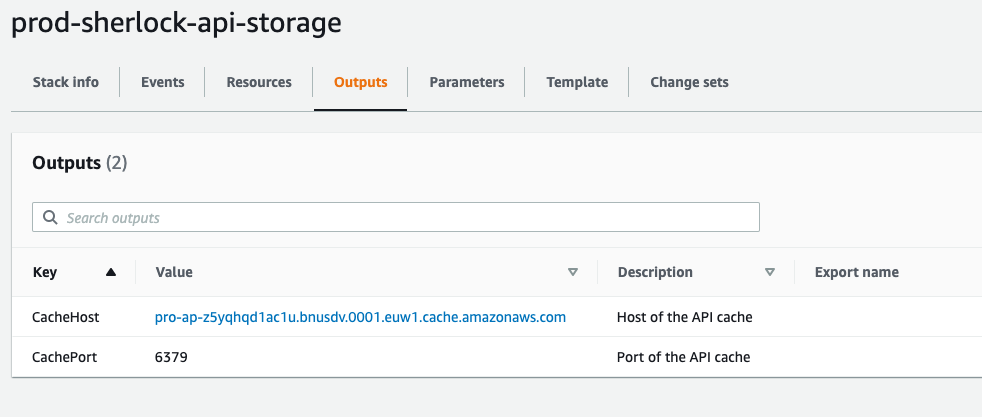

# Ansible modules

## `gather_stack_outputs`

This Ansible module retrieves the stack outputs of a given CloudFormation stack and stores the outputs in an Ansible variable as a dict.

NOTE: we get all the outputs of a stack, no matter the output is exported or not.

### Example

With the following Ansible task:
```ansible
  name: 'get storage stack'
  gather_stack_outputs:
    stack_name: 'prod-sherlock-api-storage'
    region: 'eu-west-1'
  register: storage_stack
```
on CloudFormation stack `prod-sherlock-api-storage`:


We can use the value at the subsequent tasks like:

```ansible
- debug: msg='{{ storage_stack.outputs.CacheHost }}'
  
- debug: msg= '{{ storage_stack.outputs.CachePort }}' 
```
